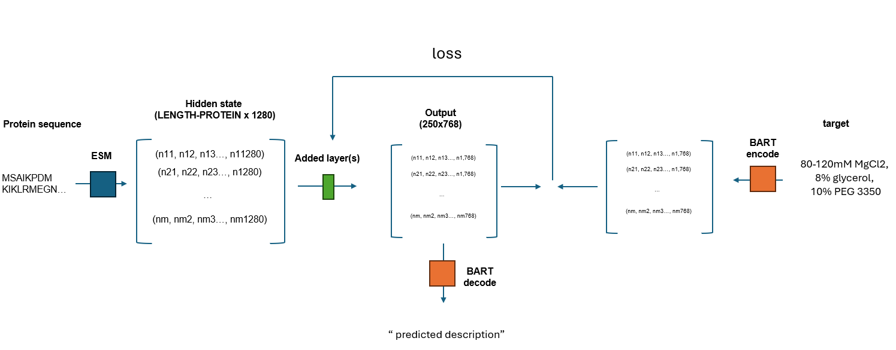

# Crystoper - Crystallization Conditions Predictor  
The crystoper repository is designed to predict crystallization conditions for proteins based on their sequence. It also showcases a scalable approach for training and developing ML models.

Current version (0.1) implements:
1. downloading entries and poly-entities data as *.json files from the PDB.
2. Parsing and processing the data into csv file.
3. Use transfer learning and train an ESM and BART based model to predict crystallization conditions from the protein sequence.
4. Using our trained model (called `ESMCcomplex`) to predict crystallization conditions for sequences.

NOTE: Our model, `ESMCcomplex` (deposited in `https://huggingface.co/oregev11/ESMCcomplex`) Was trained on ~113K instances for 15 epochs and did not converge. A better architecture of the model  may very likely result in better performance. We hope to provide such a model in the near future. Nevertheless, this repo is a great basis for (1) acquiring the PDB data and (2) training a better model. ENJOY!

# Biochemical Background
Crystallography is the golden standard for accurately determining a protein 3D structure.
The process can be divided into 4 main steps:
1. Purification - purifying the protein.
2. Crystallization - producing crystals of the protein.
3. X-RAY diffraction - omitting x-ray radiation on the crystals and monitor the diffraction.
4. Structure solving - solving the proteins structure based onf the diffraction pattern.

This work focuses on step 2 - **finding the proper crystallization conditions for a protein based on its primary sequence**

# Our Approach
The biochemical properties of proteins are derived almost exclusively from the protein primary sequence. Many computational models predict various protein features based on their sequence (2D/3D fold, enzymatic activity, interacting proteins). The proper assay conditions for a protein to form diffracting crystals can be viewed as a property derived from the protein sequence.

Here we tried to harness the embedding power of a protein language model (ESM) and natural language model (BART) to train a model that can predict proper crystallization conditions based on the protein sequence.

# Datasets
Data was taken from PDB (Protein Data Bank, https://www.rcsb.org/).
The updated list of all instances in the PDB can be downloaded from https://data.rcsb.org/rest/v1/holdings/current/entry_ids.
**In the PDB he exact reagents and used in the assay solution and their concentrations are given as a free text. We wish to train a model that given a protein sequences can predict the proper crystallization conditions.**

# The ESMC models
We called our model `ESM-Crystoper` or in short `ESMC`.
We tried 3 models with slightly different architectures we named: `EMSC`, `EMSCavg` and `ESMCcomplex`. ('ESMCcomplex' gave the best results).

Our ESMC models try to utilize transfer learning from two langue models:
1. BART- [https://arxiv.org/abs/1910.13461]
2. ESM - [https://github.com/facebookresearch/esm]

BART is a denoising autoencoder for pretraining sequence-to-sequence models. BART, a generalization of BERT has a bi-directional encoder. This means that given a sentence in english, we can use BART encoder to encode it into a vector. We can than use BART decoder to get the original sentence.
ESM is a protein-language transformer-based model. It was successfully used to predict various protein traits based on their primary sequence.

Our features space is the protein sequence.

Our labels are the BART-decoded assay conditions that are given as free text in the PDB data.

Specifically, for the `ESMCcomplex` model we changed the ESM architecture by adding layers (Additional Layers:  Dropout (0.2) > linear1 (1280 → 1024) > (1024 → 500x768) >  activation > normalization). During training, the original ESM weights are frozen so only the added layers are trained. 
The model ESMCcomplex output is a 250x768 matrix. 
During training we try to minimize the loss relative to the 250x768 BART encoding of the crystallography assay conditions.

# SETUP
`$ pip install -r requirements.txt`
The code tested on python 3.10 with CUDA 11.8.

# DOWNLOAD LATEST CHECKPOINT
To download the latest ESMCcomplex model (trained for 15 epochs):
`$ mkdir checkpoints/esmccomplex_singles_113K`
`$ wget -P checkpoints/esmccomplex_singles_113K/ https://huggingface.co/oregev11/ESMCcomplex/resolve/main/esmccomplex_singles_113K_e15.pkl?download=true`

# USAGE
## TL;DR
`notebooks/demonstrate.ipynb`

## not TL;DR

Important: Stages 1-3 perform data downloading, parsing, processing and splitting. As the processed data is already in the repository you can skip directly to stage 4.

1. Fetch the updated list of Entries and Polymer Entities from PDB and download them (this takes a few days) using `$ python download.py -f -fp -de -dpe`.
data will be saved in data/pdb_data.
2. Parse the relevant data from Entries json files (experiment data) and Polymer Entities json files (sequence of each chain in each structure) into a csv using `$ python parse.py`.
data will be saved to `data/pdb_data/parsed_data.csv`.
3. Preprocess data and pack it a csv files using `$ python process.py`. (full data will be saved to data/pdb_data/processed_data.csv. The train, test, val & toy data will be saved in `data/*.csv`)

4. Create a BART-coded representation of the crystallization conditions ('pdbx_details' feature in the PDB data) of each instance using `$ python vectorize.py -d`. Due to the large vectors size, the pickled data will be saved as shard files under `vectors/details/**/bart_vectors_*.pkl`.
5. Load a fresh ESMCcomplex model and train it on the data: `$ python3 train.py -s myESMCmodel -n 3 -b 2 -lr 0.0001 --shuffle`. To the test the training process or if you wish to over-fit the model on a tiny dataset add `--toy-train`. 

6. see DOWNLOAD LATEST CHECKPOINT for downloading latest checkpoint (The model did not converge :-( )

7. To demonstrate the model performance some proteins use `$ python3 demonstrate.py`
8. For demo with the latest model use `$ python3 demonstrate.py -c checkpoints/esmccomplex_singles_113K/esmccomplex_singles_113K.pkl`

## Extracting ESM pooled hidden layer
(Optional) - If you wish to train your own model on the sequences embedded space by extracting ESM last hidden layer you can use  `$ python vectorize.py -s`.

# FUTURE PLANS
- Parse the free text describing the asssays in to a constant-length vector describing the ammount of each reagent in the assay. This will transform the sequence-to-text task into a sequence-to-vector task which might be much more feasible task.

